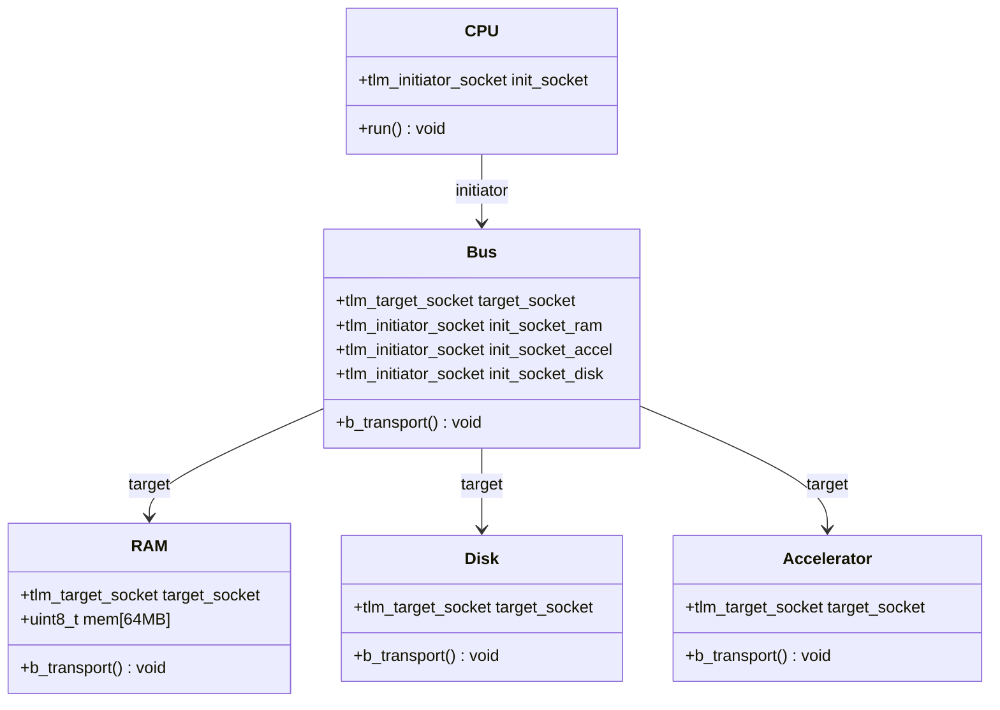
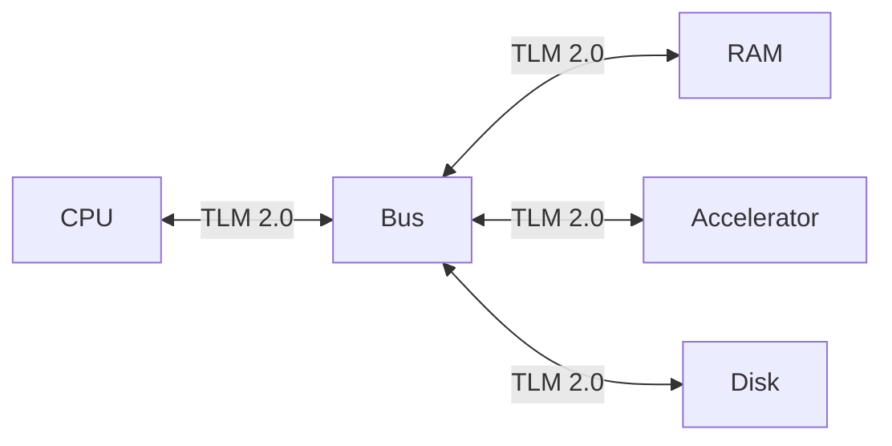
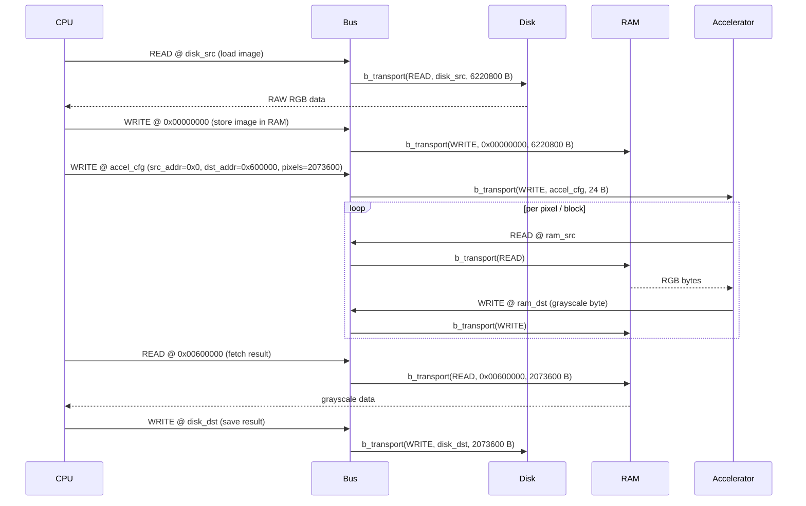

# SystemC Image Processing — TLM 2.0

> Academic project — Diseño de Alto Nivel, 2C 2026 · Due 2026-06-18

An electronic system-level model of an embedded platform that converts 1080p RAW RGB images to grayscale using **SystemC** and **TLM 2.0**.

<!-- CI badge — replace owner/repo once the repository is on GitHub -->
<!--  -->

---

## Requirements & Build Instructions

### System prerequisites

| Dependency | Minimum version | Notes |
|---|---|---|
| C++ compiler | GCC ≥ 9 or Clang ≥ 10 | Must support C++17 |
| CMake | ≥ 3.16 | Used for both building and fetching SystemC |
| Git | any | To clone the repository |
| Internet access | — | Required on first build to download SystemC (skipped if `$SYSTEMC_HOME` is set) |

**Linux (Ubuntu/Debian):**
```bash
sudo apt-get update
sudo apt-get install -y build-essential cmake git
```

**macOS:**
```bash
xcode-select --install       # provides clang and make
brew install cmake git
```

### Build

```bash
git clone <repository-url>
cd <repository>
make      # configure + download SystemC (first run ~1-2 min) + compile
make run  # build and run the simulation
make clean  # delete build directory
```

On the first run, CMake downloads and compiles SystemC 2.3.4 automatically. Subsequent builds use the cached version inside `build/`.

If SystemC is already installed, set `$SYSTEMC_HOME` before running `make` to skip the download:

```bash
export SYSTEMC_HOME=/opt/systemc   # adjust to your install path
make run
```

---

## Repository Organization

```
.
├── .github/
│   └── workflows/
│       └── build.yml        # CI: compiles and runs on every pull request
├── docs/
│   └── Enunciado.md         # Assignment specification (Spanish)
├── images/
│   ├── input/               # Input RAW RGB images (place here before running)
│   └── output/              # Grayscale output images (written here by sim)
├── src/
│   └── main.cpp             # sc_main — top-level instantiation and sc_start()
├── CMakeLists.txt           # Build system; auto-fetches SystemC if needed
├── Makefile                 # Thin CMake wrapper
├── CLAUDE.md                # Context file for Claude Code
└── README.md
```

As modules are implemented they will be added under `src/<module>/`:

```
src/
├── cpu/
│   ├── cpu.h
│   └── cpu.cpp
├── ram/
│   ├── ram.h
│   └── ram.cpp
├── disk/
│   ├── disk.h
│   └── disk.cpp
├── accelerator/
│   ├── accelerator.h
│   └── accelerator.cpp
├── bus/
│   ├── bus.h
│   └── bus.cpp
└── main.cpp
```

---

## Module Organization



| Module | File(s) | TLM role | Responsibility |
|---|---|---|---|
| **CPU** | `src/cpu/` | Initiator | Orchestrates the full flow: load → store → configure → fetch → save |
| **Bus** | `src/bus/` | Target + Initiator | Routes transactions to the correct target by address range |
| **RAM** | `src/ram/` | Target | 64 MB byte-addressable memory; holds input RGB and output grayscale |
| **Disk** | `src/disk/` | Target | Maps READ/WRITE transactions to local filesystem file I/O |
| **Accelerator** | `src/accelerator/` | Target | On WRITE to config registers, reads RGB from RAM and writes grayscale back |

---

## Block Diagram



---

## Sequence Diagram



---

## Transaction Format

All inter-module communication uses the TLM 2.0 generic payload (`tlm::tlm_generic_payload`).

| Field | Type | Description |
|---|---|---|
| `command` | `tlm_command` | `TLM_READ_COMMAND` or `TLM_WRITE_COMMAND` |
| `address` | `uint64_t` | Absolute byte address on the bus (Bus resolves to target) |
| `data_ptr` | `unsigned char*` | Pointer to the data buffer |
| `data_length` | `unsigned int` | Transfer size in bytes |
| `response_status` | `tlm_response_status` | `TLM_OK_RESPONSE` on success, `TLM_GENERIC_ERROR_RESPONSE` on failure |

### Accelerator configuration transaction

When the CPU configures the Accelerator, it issues a single 24-byte WRITE to the Accelerator's base address:

| Offset | Size | Field |
|---|---|---|
| `+0` | 8 B | Source base address in RAM (input RGB) |
| `+8` | 8 B | Destination base address in RAM (output grayscale) |
| `+16` | 8 B | Total pixel count |

---

## Memory Map

The Bus routes transactions based on address range.

| Region | Base Address | Size | Module |
|---|---|---|---|
| Input RGB image | `0x00000000` | 6,220,800 B (~5.9 MB) | RAM |
| Output grayscale image | `0x00600000` | 2,073,600 B (~1.9 MB) | RAM |
| *(free RAM)* | `0x007F9C00` | ~56 MB remaining | RAM |
| Accelerator config | `0x10000000` | 24 B | Accelerator |
| Disk | `0x20000000` | — | Disk |

RAM total capacity: 64 MB (`0x00000000` – `0x03FFFFFF`).

---

## Results

> Not yet available — the system is under development.

Once implemented, this section will include:
- Side-by-side comparison of the input RGB image and the output grayscale image.
- Simulation output log from `./build/sim`.
- Observed SystemC simulation time.

---

## CI / CD

Every pull request triggers a GitHub Actions workflow ([build.yml](.github/workflows/build.yml)) that builds SystemC (cached), compiles the project, and runs `./build/sim`. To enforce this on `master`, enable branch protection and require the `build` check to pass before merging.

---

## AI-Assisted Development

Declared as required by course policy — see [docs/Enunciado.md](docs/Enunciado.md).

| Model | Type of use | Prompt |
|---|---|---|
| Claude Sonnet 4.6 ([Claude Code](https://claude.ai/code)) | Concept lookup, code generation, documentation generation, diagram generation | *"Create the base repo: readme, gitignore, C++ SystemC template, makefile, cmake with auto-fetch of SystemC, and CI/CD pipeline for PRs. Generate a complete README with all sections required by the assignment spec; include Mermaid diagrams (block, sequence), transaction format, and memory map as base templates to be updated once the system is implemented."* |
