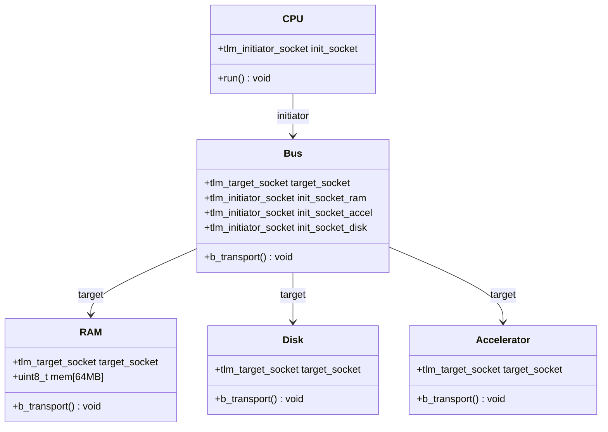
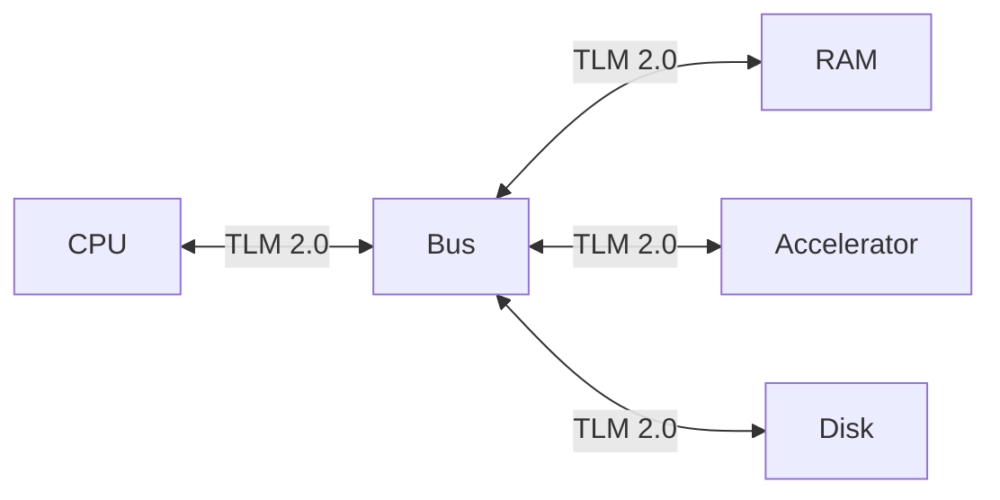
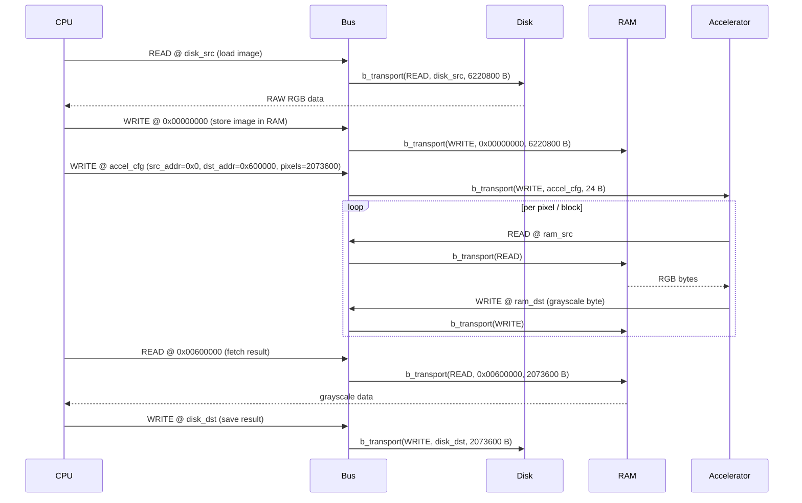

# SystemC Image Processing — TLM 2.0

> Academic project — Diseño de Alto Nivel, 2C 2026 · Due 2026-06-18

An electronic system-level model of an embedded platform that converts 1080p RAW RGB images to grayscale using **SystemC** and **TLM 2.0**.

<!-- CI badge — replace owner/repo once the repository is on GitHub -->
<!--  -->

---

## Requirements & Build Instructions

### System prerequisites

| Dependency | Minimum version | Notes |
|---|---|---|
| C++ compiler | GCC ≥ 9 or Clang ≥ 10 | Must support C++17 |
| CMake | ≥ 3.16 | Used for both building and fetching SystemC |
| Git | any | To clone the repository |
| Internet access | — | Required on first build to download SystemC (skipped if `$SYSTEMC_HOME` is set) |

**Linux (Ubuntu/Debian):**
```bash
sudo apt-get update
sudo apt-get install -y build-essential cmake git
```

**macOS:**
```bash
xcode-select --install       # provides clang and make
brew install cmake git
```

### Local Build

```bash
git clone <repository-url>
cd <repository>
make      # configure + download SystemC (first run ~1-2 min) + compile
make run  # build and run the simulation
make clean  # delete build directory
```

On the first run, CMake downloads and compiles SystemC 2.3.4 automatically. Subsequent builds use the cached version inside `build/`.

If SystemC is already installed, set `$SYSTEMC_HOME` before running `make` to skip the download:

```bash
export SYSTEMC_HOME=/opt/systemc   # adjust to your install path
make run
```

### Development Container

The repository ships a ready-to-use dev container that pre-installs all dependencies (including a compiled SystemC 2.3.4) so every team member gets an identical Linux build environment regardless of their host OS. This is the recommended alternative to a local build.

#### VS Code (recommended)

1. Install the [Dev Containers](https://marketplace.visualstudio.com/items?itemName=ms-vscode.remote-containers) extension (`ms-vscode.remote-containers`)
2. Open the repository in VS Code
3. When prompted, click **Reopen in Container** (or run the command `Dev Containers: Reopen in Container`)
4. The container builds once (~3–5 min on first run), then `make` runs automatically to verify the setup

The following extensions are pre-installed inside the container:
- **C/C++** (`ms-vscode.cpptools`) — IntelliSense, debugging
- **CMake Tools** (`ms-vscode.cmake-tools`) — build integration

#### Docker CLI (without VS Code)

```bash
docker build -t systemc-tlm .devcontainer/
docker run -it --rm -v $(pwd):/workspace -w /workspace systemc-tlm make run
```

#### GitHub Codespaces

The same `devcontainer.json` works on [GitHub Codespaces](https://github.com/features/codespaces) — click **Code → Codespaces → Create codespace** for a cloud-hosted environment with no local install required.

### CI / CD

Every pull request triggers a GitHub Actions workflow ([build.yml](.github/workflows/build.yml)) that builds SystemC (cached), compiles the project, and runs `./build/sim`. To enforce this on `master`, enable branch protection and require the `build` check to pass before merging.

---

## Repository Organization

```
.
├── .github/
│   └── workflows/
│       └── build.yml              # CI: compiles and runs on every pull request
├── docs/
│   ├── CrearModuloSystemC.md      # Step-by-step guide for implementing a new module
│   └── Enunciado.md               # Assignment specification (Spanish)
├── images/
│   ├── input/                     # Input RAW RGB images (place here before running)
│   └── output/                    # Grayscale output images (written here by sim)
├── src/
│   ├── accelerator/
│   │   ├── accelerator.h
│   │   └── accelerator.cpp
│   ├── bus/
│   │   ├── bus.h
│   │   └── bus.cpp
│   ├── cpu/
│   │   ├── cpu.h
│   │   └── cpu.cpp
│   ├── disk/
│   │   ├── disk.h
│   │   └── disk.cpp
│   ├── ram/
│   │   ├── ram.h
│   │   └── ram.cpp
│   ├── utils/
│   │   └── conversion.h           # Pure BT.601 helper (no SystemC dependency)
│   └── main.cpp                   # sc_main — top-level instantiation and sc_start()
├── AGENTS.md                      # AI assistant instructions
├── CMakeLists.txt                 # Build system; auto-fetches SystemC if needed
├── CLAUDE.md                      # Context file for Claude Code
├── Makefile                       # Thin CMake wrapper
└── README.md
```

---

## Module Organization



| Module | File(s) | TLM role | Responsibility |
|---|---|---|---|
| **CPU** | `src/cpu/` | Initiator | Orchestrates the full flow: load → store → configure → fetch → save |
| **Bus** | `src/bus/` | Target + Initiator | Routes transactions to the correct target by address range |
| **RAM** | `src/ram/` | Target | 64 MB byte-addressable memory; holds input RGB and output grayscale |
| **Disk** | `src/disk/` | Target | Maps READ/WRITE transactions to local filesystem file I/O |
| **Accelerator** | `src/accelerator/` | Target | On WRITE to config registers, reads RGB from RAM and writes grayscale back |

---

## Block Diagram



### CPU

The CPU orchestrates the entire processing pipeline. It initiates all TLM transactions: loading the raw image from Disk into RAM, configuring the Accelerator with the source address, destination address, and pixel count, then fetching the processed image back from RAM and saving it to Disk. The CPU holds no image data locally — RAM is the only intermediate buffer.

### Bus

The Bus acts as both TLM target (receiving transactions from the CPU and Accelerator) and TLM initiator (forwarding them to the correct peripheral). It decodes the transaction address and routes it to RAM (`0x00000000`–`0x03FFFFFF`), Accelerator (`0x10000000`), or Disk (`0x20000000`). All inter-module communication passes through the Bus.

### RAM

A 64 MB byte-addressable memory array. It holds the input RGB image starting at `0x00000000` and the output grayscale image starting at `0x00600000`. All inter-module data exchange passes through RAM — neither the CPU nor the Accelerator transfer image data directly to each other.

### Disk

Models the persistent file system as a SystemC module. A TLM READ transaction causes it to open the specified image file and return its bytes; a TLM WRITE transaction creates or overwrites a file with the provided data. It is the only module that performs actual filesystem I/O, keeping the rest of the system independent of the host OS.

### Accelerator

On receiving a 24-byte WRITE to its configuration register at `0x10000000`, the Accelerator reads the source RGB pixels from RAM, converts each pixel to grayscale, and writes the result back to RAM at the destination address. It uses the **BT.601 luminosity formula**:

```
Gray = 0.299 × R + 0.587 × G + 0.114 × B
```

**Input:** 3 bytes per pixel (RGB, values 0–255)  
**Output:** 1 byte per pixel (Grayscale, 0–255, rounded)

This formula reflects human eye sensitivity to different color channels:
- Green (58.7%): highest sensitivity
- Red (29.9%): medium sensitivity
- Blue (11.4%): lowest sensitivity

**Example:** RGB(100, 150, 200) → 0.299×100 + 0.587×150 + 0.114×200 = 140.75 ≈ 141 (grayscale)

See [Roboflow Image Convert Grayscale](https://inference.roboflow.com/workflows/blocks/image_convert_grayscale/) for reference.

---

## Sequence Diagram



---

## Transaction Format

All inter-module communication uses the TLM 2.0 generic payload (`tlm::tlm_generic_payload`).

| Field | Type | Description |
|---|---|---|
| `command` | `tlm_command` | `TLM_READ_COMMAND` or `TLM_WRITE_COMMAND` |
| `address` | `uint64_t` | Absolute byte address on the bus (Bus resolves to target) |
| `data_ptr` | `unsigned char*` | Pointer to the data buffer |
| `data_length` | `unsigned int` | Transfer size in bytes |
| `response_status` | `tlm_response_status` | `TLM_OK_RESPONSE` on success, `TLM_GENERIC_ERROR_RESPONSE` on failure |

### Accelerator configuration transaction

When the CPU configures the Accelerator, it issues a single 24-byte WRITE to the Accelerator's base address:

| Offset | Size | Field |
|---|---|---|
| `+0` | 8 B | Source base address in RAM (input RGB) |
| `+8` | 8 B | Destination base address in RAM (output grayscale) |
| `+16` | 8 B | Total pixel count |

---

## Memory Map

The Bus routes transactions based on address range.

| Region | Base Address | Size | Module |
|---|---|---|---|
| Input RGB image | `0x00000000` | 6,220,800 B (~5.9 MB) | RAM |
| Output grayscale image | `0x00600000` | 2,073,600 B (~1.9 MB) | RAM |
| *(free RAM)* | `0x007F9C00` | ~56 MB remaining | RAM |
| Accelerator config | `0x10000000` | 24 B | Accelerator |
| Disk | `0x20000000` | — | Disk |

RAM total capacity: 64 MB (`0x00000000` – `0x03FFFFFF`).

---

## Results

> Images are generated automatically by CI on every push to `main` that touches `src/` or the input image.

### Output image

| Input (RGB) | Output (Grayscale) |
|:-----------:|:------------------:|
|  |  |

### Simulation log

<!-- Paste the full output of ./build/sim here showing the 6-step flow:
     load from Disk → store in RAM → configure Accelerator → process → fetch from RAM → save to Disk -->

### Discussion

**1. Is the output image visually correct?**

<!-- Compare the grayscale output with the RGB input. Describe what you observe. -->

**2. Conversion correctness**

<!-- Pick a known pixel from the input (e.g. RGB(100, 150, 200)) and verify the grayscale value
     at the same position matches the BT.601 formula: 0.299×R + 0.587×G + 0.114×B. -->

**3. Simulation flow**

<!-- Does the log show the 6 steps in the correct order? Describe any deviations. -->

**4. Simulation time**

<!-- What time did SystemC report at sc_time_stamp() when the simulation finished?
     Does it reflect the real execution time? Why or why not? -->

**5. Data volume**

<!-- How many bytes did the system transfer in total (input 6,220,800 B + output 2,073,600 B)?
     Does it match what is expected for a 1920×1080 image? -->

---

## AI-Assisted Development

Declared as required by course policy — see [docs/Enunciado.md](docs/Enunciado.md).

> **Using Claude Code?** Run `/log-ai` in any Claude Code session inside this repo to append a row to the table below automatically. The command asks for model, type of use, and prompt description.


| Model | Type of use | Prompt |
|---|---|---|
| Claude Sonnet 4.6 ([Claude Code](https://claude.ai/code)) | Concept lookup, code generation, documentation generation, diagram generation | *"Create the base repo: readme, gitignore, C++ SystemC template, makefile, cmake with auto-fetch of SystemC, and CI/CD pipeline for PRs. Generate a complete README with all sections required by the assignment spec; include Mermaid diagrams (block, sequence), transaction format, and memory map as base templates to be updated once the system is implemented."* |
| Claude Sonnet 4.6 ([Claude Code](https://claude.ai/code)) | Documentation generation, code generation | *"Create docs/CrearModuloSystemC.md: a step-by-step guide for implementing a SystemC/TLM module in this project, using the Accelerator as a reference example. Covers header, cpp, conversion.h, CMakeLists, main.cpp wiring, memory map, and config format documentation."* |
| Claude Sonnet 4.6 ([Claude Code](https://claude.ai/code)) | code generation, concept lookup | *"Create a Claude Code skill following Anthropic's official skill guide to automate AI usage logging (/log-ai), placed at .claude/skills/log-ai/SKILL.md, with context inference so it derives model, type of use, and prompt from the conversation automatically."* |
